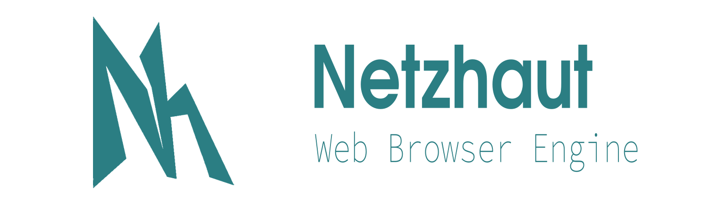

<!--NETZHAUT_INSTALLER_INSERT_BEGIN-->
```2021-02-26 14:09:11 | Netzhaut v0.0.0 INITIAL DEVELOPMENT```
<!--NETZHAUT_INSTALLER_INSERT_END-->

<div align="center"> 
 
</div> 

## About

Netzhaut runs web-technologies on the client-machine. You can use the library to write your own web-browser or anything else which makes use of web-technologies like HTML, CSS or JS.

The project is currently in **INITIAL/RAPID development**, anything is subject to change and nothing is guaranteed to work.

Please visit the [home-page](https://dajofrey.github.io/Netzhaut/home.html) if you want to know more.

[FreeType]: https://www.freetype.org/
[GCC]: https://gcc.gnu.org/
[CMake]: https://cmake.org/
[Make]: https://www.gnu.org/software/make/
[Vulkan]: https://www.khronos.org/vulkan/
[X11]: https://en.wikipedia.org/wiki/X_Window_System
[msbuild]: https://visualstudio.microsoft.com/de/downloads/ 
[doxygen]: http://www.doxygen.nl/
[Git]: https://git-scm.com/
[OpenSSL]: https://www.openssl.org/ 


